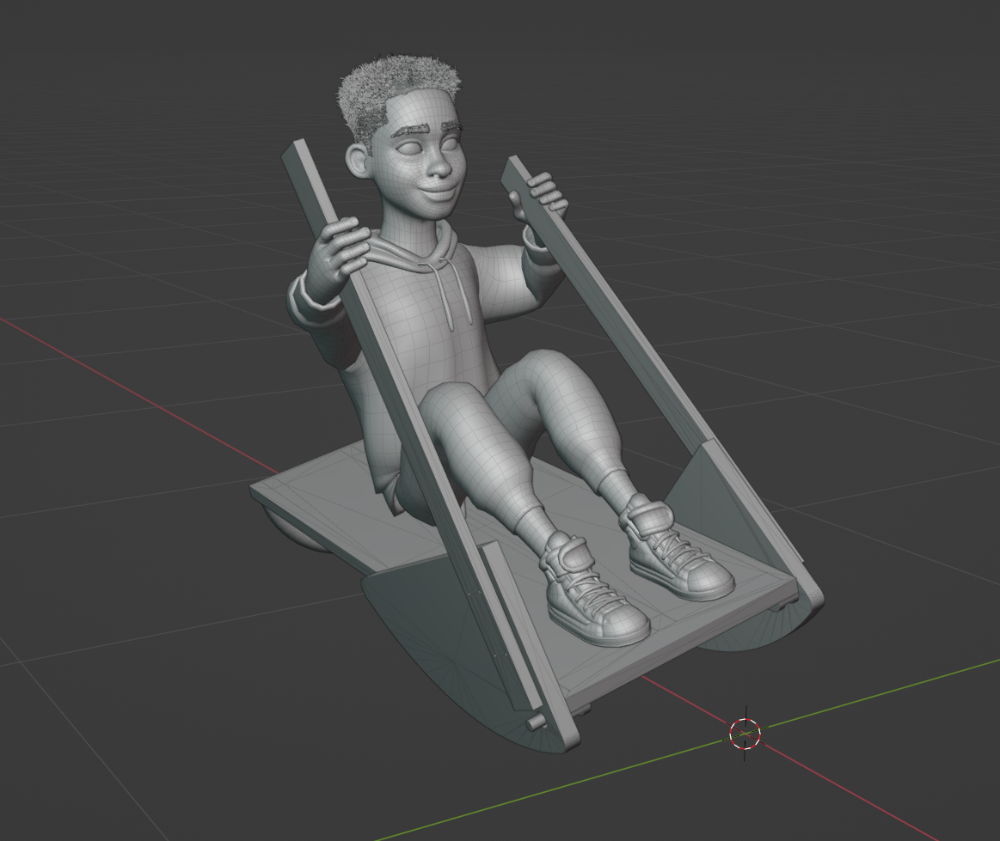
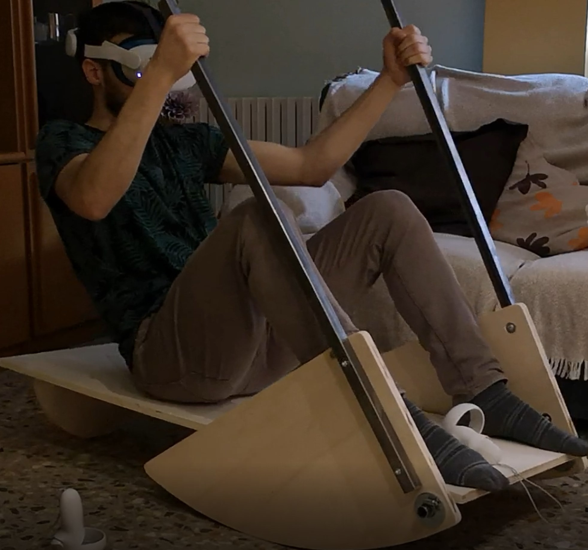

# Passive-Motion-Simulator
This project is an effort to create an affordable and human powered motion simulation apparatus wich is free to use for everyone in their games.

The main working principle relies on using the actual steering movement of the player to move the platform where the player is on along the 2dof this platform currently provides, using a VR controller or IMU system from 3rd parties the orientation ( pitch and roll ) of said platform is translated into in game motion. 

This project is opensource, read the license file for more information.

This is a very early version and should not be expected to work properly or confortably for all body types and heights.

